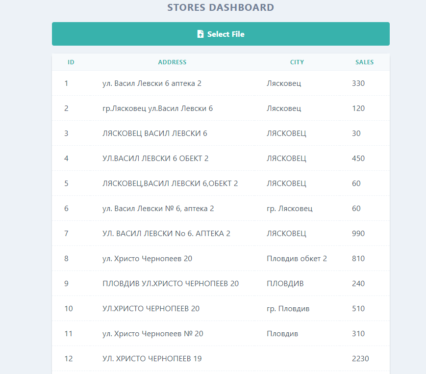

## instructions
git clone https://github.com/kikovipera/laravel-vue-excel-reader.git

cd laravel-vue-excel-reader

composer install

copy .env-example to .env

set mysql credentials inside .env file

php artisan key:generate

php artisan migrate

if your server run on different host and port change

MIX_API_URL and MIX_PUBLIC_URL inside .env file

php artisan serve 

open http://127.0.0.1:8000

